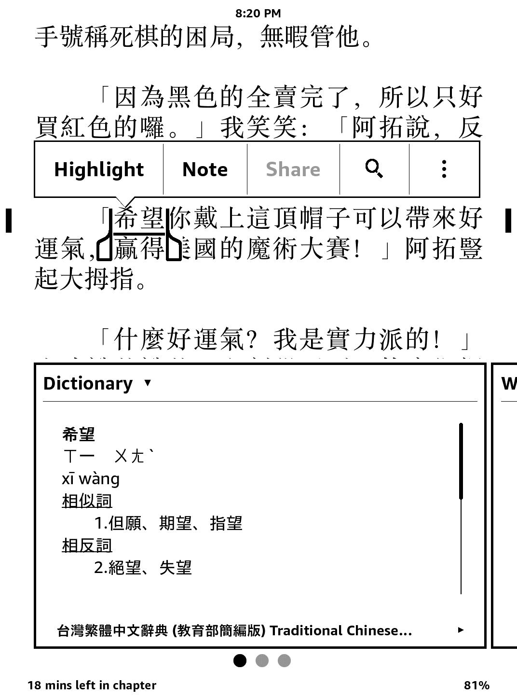
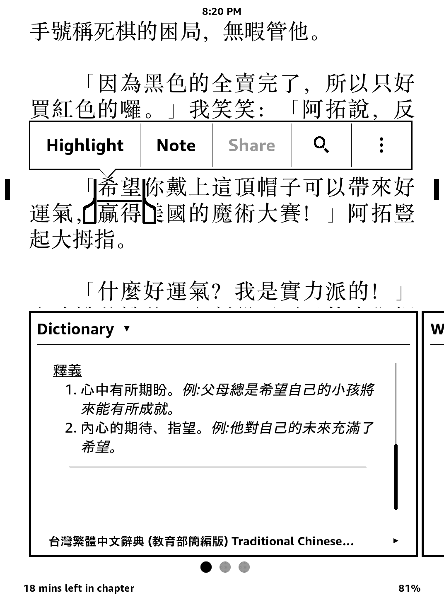

# Traditional Chinese Dictionary (Taiwan Ministry of Education Concised) 
# 台灣繁體中文辭典 (教育部簡編版)
I've searched long and hard for a Taiwanese Traditional Chinese-Traditional Chinese dictionary for the Kindle, espcially with 注音 zhuyin. There is a great Chinese-English one with 注音 (and Cantonese pronunciation!) [here](https://github.com/gkovacs/cantodict-kindle-mobi), but I was looking for an analog to Taiwan's Ministry of Education online dictionaries (台灣教育部字典). Here it is!

## Instructions

For those unfamiliar with git, download all the files here by clicking "Download ZIP" under the green Code button.

### Installation
1. Connect Kindle to computer via USB cable.
1. Copy dict_concised_v4_202108022021.mobi to (Kindle):\documents\dictionaries
1. Disconnect USB cable.
1. On the Kindle, select
    1. Settings
    1. All Settings
    1. Language & Dictionaries
    1. Dictionaries
    1. Chinese
    1. 台灣繁體中文辭典 (教育部重編版) Traditional Chinese Dictionary (Taiwan Ministry of Education Revised)

### Usage
While reading, long press and highlight a character or phrase. A definition box will appear with pronunciation and definition.

### 安裝步驟
1. 用 USB 傳輸線將 Kindle 連接到電腦。
1. 將 dict_concised_v4_202108022021.mobi 複製到 (Kindle):\documents\dictionaries
1. 移除 USB 傳輸線。
1. 在 Kindle 觸控螢幕上，選擇
    1. 設置
    1. 全部設置
    1. 語言和字典
    1. 字典
    1. 中文
    1. 台灣繁體中文辭典 (教育部重編版) Traditional Chinese Dictionary (Taiwan Ministry of Education Revised)

### 使用說明
閱讀時，可長按字詞，Kindle 會自動查詢並彈出釋義框。

### Screenshots
注音 Pronunciation and syn/antonyms             |  Examples
:-------------------------:|:-------------------------:
  | 

### Notes about the project
* originally wanted to use [this](https://github.com/g0v/moedict-data/blob/master/dict-revised.json) awesome file of the revised dictionary but seems a little bit outdated and most importantly the file is too large for Amazon's own Kindle dictionary creator to process
* didn't want to, but scraped the [concised dictionary](http://dict.concised.moe.edu.tw/) and created the dictionary from that
* noticed that Kindle Previewer 3 could not create dictionaries with Chinese in the non-content.html pages (think that was the problem), so I've preserved a copy of all .html's under html-with-chinese/ but in practice should use the English versions
* I have the scraper as a private repo that is pending cleanup as of 2021.10.09